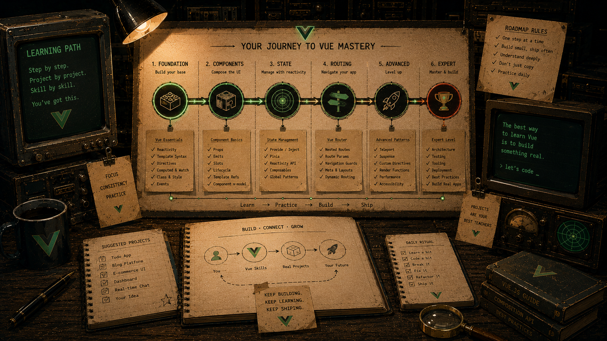

# Learning Path & Exam Coverage

The mid-level Vue.js certification exam is **30 multiple-choice questions + 105 minutes of coding challenges**. The coding block is multi-component work, so this repository is organised in six batches: fundamentals inside one component (Batch 1), component composition and the ecosystem (Batch 2), the reusable component patterns (Batch 3), composables that own side effects (Batch 4), Pinia and Router at scale (Batch 5), and the exam's bug-fixing challenge (Batch 6). Thirty exercises, 479 tests.

Every exercise is Vue 3 + TypeScript, and every exercise ships a **red** test suite that encodes its requirements and edge cases.

## Batch 1 — fundamentals (01–05)

| #   | Exercise        | Core skills                                          | Time   | Tests |
| --- | --------------- | ---------------------------------------------------- | ------ | ----- |
| 01  | Scroll to Item  | template refs, DOM APIs, `nextTick`, validation      | 25 min | 16    |
| 02  | Shopping List   | reactive CRUD, inline editing, view vs domain state  | 30 min | 14    |
| 03  | Search Users    | `computed` caching, `v-model`, filtering             | 25 min | 15    |
| 04  | Sort Products   | multi-dependency computed, immutability, comparators | 15 min | 9     |
| 05  | Counter History | composables, encapsulated state, computed guards     | 30 min | 20    |

### What each one is really teaching

- **01** — a function `ref` collecting one template ref per `v-for` row, why the class binding needs `nextTick` before you scroll, and why a repeated submission must _reset_ the highlight timer instead of stacking a second one.
- **02** — the separation that most CRUD code gets wrong: `editingId` + `draft` as view state, items as domain data. Put `editing` on the item and "sort while editing" or "delete the row you are editing" breaks.
- **03** — `computed` vs method: caching until a dependency actually changes. Expect to be asked to justify it.
- **04** — `Array.prototype.sort` mutates. Sorting a shared reactive source in place inside a computed is a side effect from a place that must not have side effects. Also: numeric vs lexicographic comparison and deterministic tie-breaking.
- **05** — a real `useX()` composable: all state and rules inside, `count` exposed as a read-only `ComputedRef`, `canUndo`/`canRedo` as computed guards, no module-level state so every caller gets an independent instance. The composable is unit-tested without mounting anything.

## Batch 2 — composition & ecosystem (06–12)

| #   | Exercise             | Core skills                                                             | Time   | Tests |
| --- | -------------------- | ----------------------------------------------------------------------- | ------ | ----- |
| 06  | Base Input           | typed props/emits, `defineModel`, `$attrs` fallthrough, `useId`         | 35 min | 20    |
| 07  | Data Table Slots     | named + scoped slots, fallbacks, `defineSlots`, generic component       | 35 min | 17    |
| 08  | Theme Provider       | `provide`/`inject`, typed `InjectionKey`, Vue plugin, app state         | 30 min | 11    |
| 09  | Router Master/Detail | dynamic params, `beforeEnter` guards, lazy routes, reuse                | 35 min | 11    |
| 10  | Pinia Cart           | setup stores, getters, actions, `storeToRefs`, shared state             | 40 min | 28    |
| 11  | Async Search         | `watch`, `onWatcherCleanup`, debounce, `AbortController`, races         | 40 min | 20    |
| 12  | Composable Storage   | `effectScope`, `onScopeDispose`, deep `watch`, SSR guards, `shallowRef` | 35 min | 18    |

### What each one is really teaching

- **06** — the parent owns the value. `defineModel<string>({ required: true })` instead of mutating a prop, and `defineOptions({ inheritAttrs: false })` + `v-bind="$attrs"` so `placeholder`/`type`/`data-testid` land on the `<input>` rather than the wrapper `
`. Also error _timing_: nothing shows until the first submit attempt.
- **07** — who owns the loop vs. who owns the cell. A scoped slot passes `{ item, index }` out and must stop rendering its fallback the moment the consumer supplies content. `generic="T extends { id: number | string }"` keeps the table typed without an `any`.
- **08** — `app.provide` inside a plugin's `install()`, not `provide()` in a component, so any depth can reach it without prop drilling. A typed `InjectionKey<ThemeApi>` (a plain string key gives you `unknown`), read-only `ComputedRef`s out and actions in, a thrown error when the plugin is missing, and no module-level state — two apps must theme independently.
- **09** — navigating `/users/1` → `/users/2` matches the same route record, so Vue Router **reuses the component instance and `setup()` never runs again**. Anything read from `route.params` in plain code is frozen at the first value; derive it with `computed` or re-fetch in a `watch`. Plus `createAppRouter(history?)`, so tests can inject `createMemoryHistory()`.
- **10** — destructuring a store snapshots it: `const { total } = useCartStore()` is dead, `storeToRefs(cart)` is not. Stores are singletons _per pinia instance_, which is why the specs create a fresh `createPinia()` each test. And money: round in the getter, because `9.99 * 3` is `29.970000000000002`.
- **11** — four separate failure modes in one composable: debounce _before_ the request, abort the in-flight one via `onWatcherCleanup`, ignore stale responses with a request ticket (aborting is not enough — a mocked API still resolves), and never treat an `AbortError` as an error.
- **12** — a composable that owns environment side effects and gives them back. `onScopeDispose` for the `storage`/`resize` listener, deep `watch` so a nested field persists, a fallback when the stored JSON is corrupt, `typeof window === 'undefined'` guards for SSR, and `shallowRef` where the value is a number that is always replaced.

## Batch 3 — component patterns (13–17)

The reusable primitives, and the accessibility contract that comes with each one.

| #   | Exercise     | Core skills                                                              | Time   | Tests |
| --- | ------------ | ------------------------------------------------------------------------ | ------ | ----- |
| 13  | Accordion    | single-source view state, conditional rendering, typed props/emits, ARIA | 20 min | 10    |
| 14  | Dynamic Tabs | derived selection, `watch` on props, list refresh, ARIA state            | 25 min | 11    |
| 15  | Dynamic Form | schema-driven rendering, control dispatch, validation timing, `useId`    | 35 min | 12    |
| 16  | Rating       | `defineModel`, preview vs committed state, keyboard support, ARIA slider | 30 min | 15    |
| 17  | Modal        | slots with fallbacks, scoped slots, `.self` modifier, listener lifecycle | 30 min | 14    |

### What each one is really teaching

- **13** — one `openId`, not a boolean per section: "only one open at a time" becomes true _by construction_ instead of by an invariant you have to maintain. Plus `defaultOpen` that must be validated against sections which actually exist, and `v-if` on the panel because the spec asserts absence.
- **14** — what happens to the selected tab when the tab _list_ changes underneath it. A `watch` on the props, and a selection that is derived rather than stored, so a removed tab can't leave a dangling id.
- **15** — the form you can't hand-write: one control per schema entry, `v-if`/`v-else-if` dispatching on `type`, a model seeded _and re-seeded_ when the schema prop changes, and errors that appear only after the first submit attempt.
- **16** — two pieces of state that look like one. Hover preview is not the committed value, and `defineModel` owns only the latter; conflating them is the classic rating-widget bug. Keyboard support makes it an input rather than a row of buttons.
- **17** — `@click.self` on the backdrop, so a click that started inside the dialog doesn't close it, and a `keydown` listener that is removed when the modal goes away rather than when the app does.

## Batch 4 — stateful UI & composables (18–23)

A harder pass at 05/11/12: every composable here owns a timer, a request, or a browser API, and has to give it back.

| #   | Exercise           | Core skills                                                       | Time   | Tests |
| --- | ------------------ | ----------------------------------------------------------------- | ------ | ----- |
| 18  | Notification Queue | composable factory, one timer per item, `onScopeDispose`          | 30 min | 18    |
| 19  | Pagination         | generic composable, derived clamping, page-size reset             | 30 min | 18    |
| 20  | Infinite Scroll    | injected loader, in-flight guard, end-of-data detection, recovery | 35 min | 19    |
| 21  | `useCountdown()`   | interval ownership, guard against double timers, `onScopeDispose` | 30 min | 22    |
| 22  | `useFetch()`       | request state machine, per-instance cache, retry, stale responses | 35 min | 19    |
| 23  | Clipboard          | feature detection, injected side effect, timed UI flash           | 25 min | 15    |

### What each one is really teaching

- **18** — a timer _per item_, each cancelled individually when its toast is dismissed early, and all of them cancelled when the scope dies. The spec builds two queues and asserts they don't share state.
- **19** — clamping as derivation, not as an assignment. When the page size changes, the current page has to fall back into range without a `watch` fighting a `computed` over who owns the number.
- **20** — calling `load()` twice because the second scroll event arrived before the first request resolved. An in-flight guard, a "there is no more data" terminal state, and an error that leaves you able to retry.
- **21** — `setInterval` is easy; owning it is not. Starting an already-running countdown must not create a second interval, and the interval must die with the scope, not with the component.
- **22** — the full request state machine plus a cache: a cached key must never flip `loading` to true, a retry has to bypass the cache, and a response that arrives after a newer key was requested has to be dropped.
- **23** — `navigator.clipboard` may not exist. Feature-detect it, inject it so the spec can supply its own, and make the "Copied!" flash a timer you clean up.

## Batch 5 — ecosystem at scale (24–28)

Pinia and Vue Router doing real work together, including the URL as application state.

| #   | Exercise                  | Core skills                                                          | Time   | Tests |
| --- | ------------------------- | -------------------------------------------------------------------- | ------ | ----- |
| 24  | Pinia Wishlist            | setup store, getter returning a function, deep `watch`, guards       | 35 min | 18    |
| 25  | Auth Store & Route Guards | Pinia + Router, global `beforeEach`, route meta, redirect round-trip | 40 min | 21    |
| 26  | Dashboard Stats           | store getters as derivations, defensive parsing, rounding            | 30 min | 18    |
| 27  | Query Filters             | URL as state, `route.query` normalisation, clean URLs                | 35 min | 16    |
| 28  | Breadcrumbs               | `route.matched`, route meta, nested routes, param interpolation      | 30 min | 10    |

### What each one is really teaching

- **24** — a getter that returns a _function_ (`isFavourite(id)`) rather than a precomputed set, persistence through a deep `watch`, and a stored value that might be corrupt JSON, not an array, or full of things that aren't numbers.
- **25** — the two halves of auth. The store knows _who_ you are; the router's global `beforeEach` decides _where_ that lets you go. Plus the redirect round-trip: remember where the visitor was headed and return them there after login.
- **26** — getters as pure derivations over store state, with defensive parsing on the way in. The rounding lesson from 10, applied to averages instead of money.
- **27** — the URL is the state, not a mirror of it. Normalise `route.query` (a param can be missing, repeated, zero, negative, or not a number), keep defaults _out_ of the URL, and reset to page 1 when a filter changes.
- **28** — never hand-write a breadcrumb trail. Walk `route.matched`, skip records without `meta.breadcrumb`, call function labels with the current route, and interpolate params so an intermediate crumb links to `/products/tools` rather than `/products/:category`.

## Batch 6 — debugging (29–30)

The certification's bug-fixing challenge. These invert the format: `src/` is **complete but wrong**, and the work is reading.

| #   | Exercise                           | Core skills                                                     | Time   | Tests |
| --- | ---------------------------------- | --------------------------------------------------------------- | ------ | ----- |
| 29  | Debug: Reactivity, Computed, Watch | reading broken reactive code                                    | 25 min | 15    |
| 30  | Debug: Emits & Pinia               | the `v-model` contract, store reactivity, module vs setup scope | 20 min | 9     |

### What each one is really teaching

- **29** — the failure modes that still _render_ the first time: a destructured `reactive()` that lost its reactivity, a `computed` doing work that belonged in a `watch`, a watcher missing `deep`. The symptom is always "it works once, then stops."
- **30** — a child that emits the wrong event name for `v-model`, and a store whose state was declared in module scope instead of inside the setup function, so every instance shares it. Both look fine until there are two of something.

## Exam-topic coverage

| Topic                                                     | Where                              |
| --------------------------------------------------------- | ---------------------------------- |
| Reactivity fundamentals                                   | 01–05, 10, 12, 29, 30              |
| Computed properties                                       | 03, 04, 05, 09, 10, 19, 26, 27, 28 |
| Watchers                                                  | 11, 12, 14, 24                     |
| Template refs / DOM                                       | 01, 20                             |
| Forms & validation                                        | 01, 02, 06, 15                     |
| Advanced props & events                                   | 06, 13, 16, 30                     |
| Slots (named + scoped)                                    | 07, 17                             |
| Provide/inject & plugins                                  | 08                                 |
| Vue Router                                                | 09, 25, 27, 28                     |
| Global state management                                   | 10, 24, 25, 26, 30                 |
| Composables                                               | 05, 11, 12, 18–23                  |
| Lifecycle & cleanup                                       | 01, 11, 12, 17, 18, 21, 23         |
| Async, races, cancellation                                | 11, 20, 22, 25                     |
| Accessibility (ARIA state, keyboard)                      | 06, 13, 14, 16, 17, 28             |
| Debugging broken reactive code                            | 29, 30                             |
| Performance (`shallowRef`, lazy routes, computed caching) | 03, 04, 09, 12, 22                 |
| TypeScript with Vue                                       | every exercise                     |
| Testing (Vitest + VTU)                                    | every exercise                     |

Not covered by design: render functions / `h()`, custom directives, Transitions, Teleport, Suspense, SSR. Read the Vue docs for those and expect a multiple-choice question or two. Note that 17 builds a modal **without** `Teleport` on purpose — the exercise is about slots, the `.self` modifier and listener lifecycle, not about where the node lands in the DOM.

## Prerequisites

- Vue 3 basics: components, templates, `v-bind`, `v-for`, `v-on`
- TypeScript basics: interfaces, generics on `ref<T>()`/`computed<T>()`, union types
- JavaScript: array methods, spread, optional chaining
- DOM: `scrollIntoView`, `classList`, event objects

For Batch 2, add: Vue Router and Pinia basics, `Promise`/`async`–`await`, `AbortController`, and `localStorage`.

For Batches 3–6, add: ARIA state attributes (`aria-expanded`, `aria-selected`, `aria-current`) and keyboard event handling, `setInterval`/`setTimeout` ownership, `navigator.clipboard`, and reading `route.query` / `route.matched`.

## Suggested reading

- [Reactivity fundamentals](https://vuejs.org/guide/essentials/reactivity-fundamentals.html)
- [Computed properties](https://vuejs.org/guide/essentials/computed.html)
- [Watchers](https://vuejs.org/guide/essentials/watchers.html)
- [Template refs](https://vuejs.org/guide/essentials/template-refs.html)
- [Composables](https://vuejs.org/guide/reusability/composables.html)
- [Props](https://vuejs.org/guide/components/props.html) · [Events](https://vuejs.org/guide/components/events.html) · [v-model](https://vuejs.org/guide/components/v-model.html)
- [Slots](https://vuejs.org/guide/components/slots.html) · [Provide/Inject](https://vuejs.org/guide/components/provide-inject.html)
- [Vue Router](https://router.vuejs.org/guide/) · [Pinia](https://pinia.vuejs.org/core-concepts/)
- [TypeScript with Composition API](https://vuejs.org/guide/typescript/composition-api.html)
- [Component `v-model`](https://vuejs.org/guide/components/v-model.html) and [fallthrough attributes](https://vuejs.org/guide/components/attrs.html)
- [Slots](https://vuejs.org/guide/components/slots.html) and [provide/inject](https://vuejs.org/guide/components/provide-inject.html)
- [Vue Router: dynamic matching](https://router.vuejs.org/guide/essentials/dynamic-matching.html) and [navigation guards](https://router.vuejs.org/guide/advanced/navigation-guards.html)
- [Pinia: setup stores](https://pinia.vuejs.org/core-concepts/) and [`storeToRefs`](https://pinia.vuejs.org/api/modules/pinia.html#storetorefs)

## Timing notes

The time limits are exam-realistic. If you are consistently over, the bottleneck is usually not Vue — it is reading the requirements. Read the DOM contract table first, then write the test-shaped implementation.

## Progress checklist

- [ ] 01 Scroll to Item — 16/16 green, typecheck clean
- [ ] 02 Shopping List — 14/14 green, typecheck clean
- [ ] 03 Search Users — 15/15 green, typecheck clean
- [ ] 04 Sort Products — 9/9 green, typecheck clean
- [ ] 05 Counter History — 20/20 green, typecheck clean
- [ ] 06 Base Input & Form — 20/20 green, typecheck clean
- [ ] 07 Data Table with Slots — 17/17 green, typecheck clean
- [ ] 08 Theme Provider — 11/11 green, typecheck clean
- [ ] 09 Router Master / Detail — 11/11 green, typecheck clean
- [ ] 10 Pinia Cart — 28/28 green, typecheck clean
- [ ] 11 Async Search — 20/20 green, typecheck clean
- [ ] 12 Composable Storage — 18/18 green, typecheck clean
- [ ] 13 Accordion — 10/10 green, typecheck clean
- [ ] 14 Dynamic Tabs — 11/11 green, typecheck clean
- [ ] 15 Dynamic Form — 12/12 green, typecheck clean
- [ ] 16 Rating — 15/15 green, typecheck clean
- [ ] 17 Modal — 14/14 green, typecheck clean
- [ ] 18 Notification Queue — 18/18 green, typecheck clean
- [ ] 19 Pagination — 18/18 green, typecheck clean
- [ ] 20 Infinite Scroll — 19/19 green, typecheck clean
- [ ] 21 `useCountdown()` — 22/22 green, typecheck clean
- [ ] 22 `useFetch()` — 19/19 green, typecheck clean
- [ ] 23 Clipboard — 15/15 green, typecheck clean
- [ ] 24 Pinia Wishlist — 18/18 green, typecheck clean
- [ ] 25 Auth Store & Route Guards — 21/21 green, typecheck clean
- [ ] 26 Dashboard Stats — 18/18 green, typecheck clean
- [ ] 27 Query Filters — 16/16 green, typecheck clean
- [ ] 28 Breadcrumbs — 10/10 green, typecheck clean
- [ ] 29 Debug: Reactivity, Computed & Watch — 15/15 green, typecheck clean
- [ ] 30 Debug: Emits & Pinia — 9/9 green, typecheck clean
