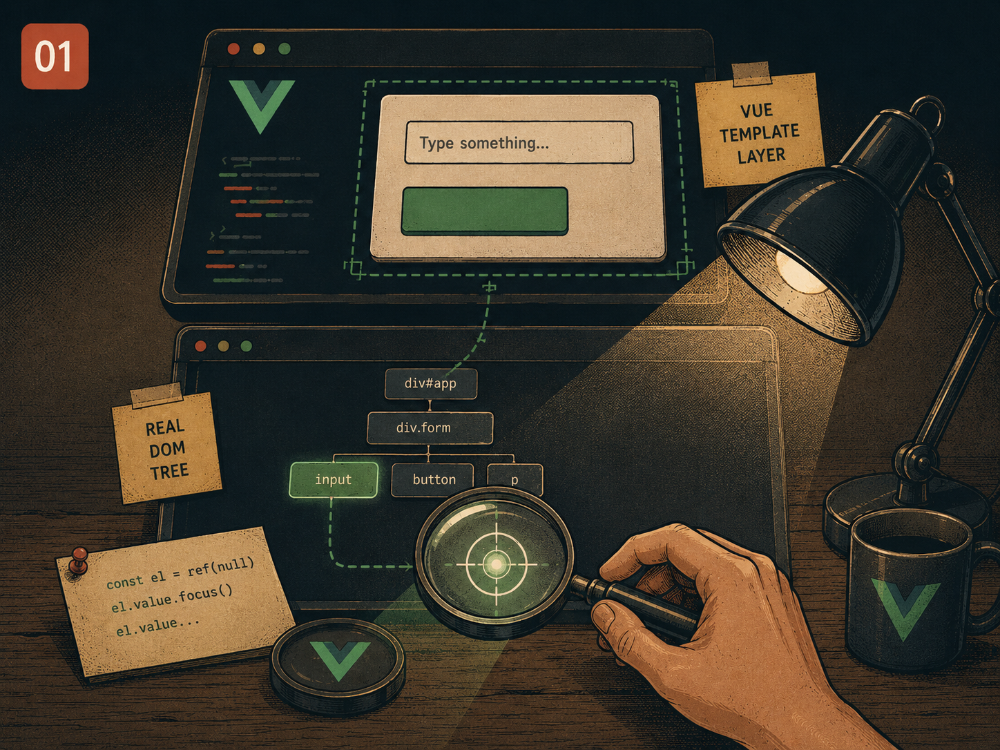

# Lesson 01 — Reaching the real DOM from Vue

> Prep for Exercise 01. Concepts and examples only — this page does not
> discuss the exercise's edge cases or its solution.

## The problem

Vue templates describe what the DOM _should_ look like; you almost never touch
a DOM node directly. But some things simply are not reactive data — you cannot
express "call `.focus()` on this input" or "scroll this element into view" as
a prop or a computed. Those are one-shot imperative calls on a real,
already-rendered element, and Vue's declarative model has no slot for them.

So you need an escape hatch: a way to say "give me the actual `HTMLElement`
Vue rendered for this piece of template," used only for the handful of things
that genuinely require it.



## The main idea

The obvious escape hatch is to reach past Vue entirely:

```vue
<script setup lang="ts">
function focusInput() {
  const el = document.querySelector(".search-box");
  el.focus();
}
</script>

<template>
  <input class="search-box" type="email" />
  <button @click="focusInput">Focus</button>
</template>
```

This works, once, in a tiny demo — and breaks three separate ways the moment
the app grows:

1. **It isn't scoped to this component.** `document.querySelector` searches
   the whole page. If a second copy of this component is mounted anywhere —
   another instance, a modal, a test that renders it twice — the selector
   finds whichever `.search-box` happens to come first in the document, not
   necessarily this one.
2. **It fights Vue's own render cycle.** Vue batches DOM updates: when you
   change a `ref` used in the template, the DOM does not update synchronously
   right then — it updates on the next "tick." Code that reads the DOM
   immediately after changing reactive state can read the _old_ DOM, and a
   plain `document.querySelector` call has no way to know to wait.
3. **It has no null-safety.** `document.querySelector` returns
   `Element | null` with no compile-time link to whether the element has
   actually mounted yet. Call it before the component renders — e.g. in
   `<script setup>`'s top-level code — and `el` is `null`, so `el.focus()`
   throws.

Vue's answer is the **template ref**: bind `ref="someName"` on a template
element, and Vue populates a matching `ref()` in your script with that exact
element once it mounts.

```vue
<script setup lang="ts">
import { ref } from "vue";

const inputEl = ref<HTMLInputElement | null>(null);

function focusInput() {
  inputEl.value?.focus();
}
</script>

<template>
  <input ref="inputEl" type="email" />
  <button @click="focusInput">Focus</button>
</template>
```

Three things changed, and each one fixes a failure mode above:

- `inputEl` is scoped to _this component instance_ — two mounted copies each
  get their own `inputEl`, never each other's element.
- The type is `HTMLInputElement | null`, not `Element | null` cast away. The
  compiler makes you handle the `null` case (`?.`) instead of trusting that
  the element exists.
- It really can be `null` — before the component mounts, and after it
  unmounts, `inputEl.value` is `null`. That is not a bug to work around; it is
  the type telling you the truth about the element's lifetime.

### `useTemplateRef` (Vue 3.5+)

The pattern above requires a script-side `ref()` whose _variable name_
matches the template's `ref="..."` string exactly — easy to typo, and awkward
if you want to derive the name. `useTemplateRef` makes that binding explicit
instead of name-based magic:

```vue
<script setup lang="ts">
import { useTemplateRef } from "vue";

const inputEl = useTemplateRef<HTMLInputElement>("email-field");

function focusInput() {
  inputEl.value?.focus();
}
</script>

<template>
  <input ref="email-field" type="email" />
  <button @click="focusInput">Focus</button>
</template>
```

Same result, same nullability — `useTemplateRef` is a lookup by string id
rather than a same-named binding, which reads more clearly when the string
and the variable diverge.

### Function refs in `v-for`

A single `ref="name"` gives you one element. A `v-for` renders many, and
there is no fixed number of names to hand out. The fix is a **function ref**:
instead of a string, `:ref` takes a callback that Vue calls with the element
each time one mounts (and with `null` when it unmounts):

```vue
<script setup lang="ts">
import { ref } from "vue";

const fruits = ["apple", "pear", "plum"];
const fruitEls = ref<HTMLLIElement[]>([]);

function setFruitRef(el: Element | null) {
  if (el) fruitEls.value.push(el as HTMLLIElement);
}
</script>

<template>
  <ul>
    <li v-for="fruit in fruits" :key="fruit" :ref="setFruitRef">
      {{ fruit }}
    </li>
  </ul>
</template>
```

Two details that trip people up the first time:

- The callback fires on **every** render, for mount and unmount alike — if
  you push into an array without clearing it first, the array grows on every
  re-render. In practice you reset it (`fruitEls.value = []`) right before the
  `v-for`'s elements re-mount, or key the collection by an id in a `Map`
  instead of an array index.
- The order elements mount in is not guaranteed to match `v-for`'s source
  order once items are added or removed, so code that needs "the element for
  fruit at index 2" should look it up by key, not by array position.

### The `nextTick` rule

Reactive state and the DOM update on different clocks. Say a click handler
adds an item to a list and then immediately wants to measure the height of
the element that item was just rendered into:

```vue
<script setup lang="ts">
import { ref } from "vue";

const items = ref(["a", "b"]);
const listEl = ref<HTMLUListElement | null>(null);

function addAndMeasure() {
  items.value.push("c");
  // listEl still has the OLD height here — 'c' hasn't rendered yet
  console.log(listEl.value?.offsetHeight);
}
</script>

<template>
  <ul ref="listEl">
    <li v-for="item in items" :key="item">{{ item }}</li>
  </ul>
</template>
```

Changing `items.value` schedules a DOM update; it does not perform it
synchronously. `listEl.value?.offsetHeight` right after the `push` reads the
DOM as it looked _before_ the new `<li>` was added. `nextTick()` returns a
promise that resolves once Vue has flushed pending DOM updates:

```vue
<script setup lang="ts">
import { nextTick, ref } from "vue";

const items = ref(["a", "b"]);
const listEl = ref<HTMLUListElement | null>(null);

async function addAndMeasure() {
  items.value.push("c");
  await nextTick();
  // now listEl reflects the DOM with 'c' rendered
  console.log(listEl.value?.offsetHeight);
}
</script>

<template>
  <ul ref="listEl">
    <li v-for="item in items" :key="item">{{ item }}</li>
  </ul>
</template>
```

The rule of thumb: any time you change reactive state and the very next line
reads something from the real DOM, that read needs to be on the other side of
an `await nextTick()`.

## Reference

→ `docs/PATTERNS.md` § "Template Refs to Access DOM Elements"
→ No earlier lessons — this is Lesson 01

## Sources

- Vue.js official docs — [Template Refs](https://vuejs.org/guide/essentials/template-refs.html)
- Vue.js official docs — [`useTemplateRef()`](https://vuejs.org/api/composition-api-helpers.html#usetemplateref)
- Vue.js official docs — [`nextTick()`](https://vuejs.org/api/general.html#nexttick)
- Vue.js official docs — [Function Refs](https://vuejs.org/guide/essentials/template-refs.html#function-refs)
- Vue.js official docs — [Refs inside `v-for`](https://vuejs.org/guide/essentials/template-refs.html#refs-inside-v-for)
- MDN — [`HTMLElement.focus()`](https://developer.mozilla.org/en-US/docs/Web/API/HTMLElement/focus) (the kind of imperative DOM call template refs exist for)
- Michael Thiessen — [Everything You Need to Know About Vue Refs](https://michaelnthiessen.com/everything-you-need-to-know-about-refs) (independent walkthrough of template ref pitfalls)

## Now do Exercise 01

<a href="https://github.com/GadDev/vue-mid-level-certification/tree/main/packages/01-scroll-to-item" target="_blank">Open exercise on GitHub</a>

<MarkComplete id="01" />
