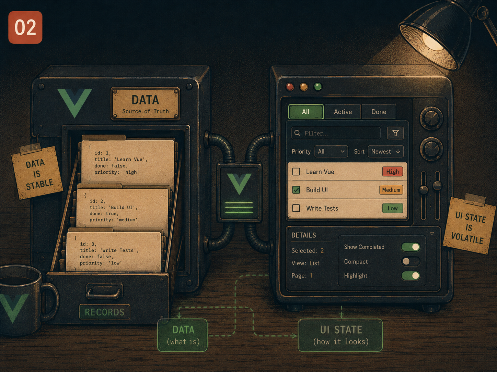

# Lesson 02 — State that describes the UI vs. state that describes the data

> Prep for Exercise 02. Concepts and examples only — this page does not
> discuss the exercise's edge cases or its solution.

## The problem

A list of records and "which row is currently being edited" feel like they
belong together — they're both about the same row, so it's tempting to store
them in the same place. But they answer two different questions. The data
answers *what exists*: a task, its name, its id. The UI state answers *what
is the screen doing right now*: is this row in edit mode, what has the user
typed so far but not yet confirmed. Conflating the two means every operation
that touches the data — sorting, deleting, duplicating — also has to
carefully preserve or migrate the UI state riding along on it, and it is easy
to miss a case.



## The main idea

The naive approach puts editing flags directly on each record:

```vue
<script setup lang="ts">
import { ref } from 'vue'

interface Task {
  id: number
  title: string
  editing: boolean
  draft: string
}

const tasks = ref<Task[]>([
  { id: 1, title: 'Write report', editing: false, draft: '' },
  { id: 2, title: 'Review PR', editing: false, draft: '' },
])

function startEdit(task: Task) {
  task.editing = true
  task.draft = task.title
}

function remove(id: number) {
  tasks.value = tasks.value.filter(t => t.id !== id)
}
</script>
```

This looks reasonable until the operations start interacting. Sort the list
while `tasks[0]` is mid-edit, and the editing row moves with its data —
fine, that part actually works, because `editing`/`draft` travel with the
object. The real failure shows up elsewhere: duplicate a task with
`{ ...task, id: nextId() }` and the copy inherits `editing: true` and
whatever `draft` text was mid-typed, so both the original and the copy
appear to be in edit mode at once — even though only one row should ever be
editable. The bug isn't a missing case to patch; it's that "is this row being
edited" was never data about the task, so anything that copies or transforms
task data ends up copying UI state it should never have touched.

The idiom is to keep two separate pieces of state — the array of pure
records, and view state describing what the UI is doing — and connect them
only by id:

```vue
<script setup lang="ts">
import { ref } from 'vue'

interface Task {
  id: number
  title: string
}

const tasks = ref<Task[]>([
  { id: 1, title: 'Write report' },
  { id: 2, title: 'Review PR' },
])

const editingId = ref<number | null>(null)
const draft = ref('')

function startEdit(task: Task) {
  editingId.value = task.id
  draft.value = task.title
}

function saveEdit() {
  const task = tasks.value.find(t => t.id === editingId.value)
  if (task && draft.value.trim()) task.title = draft.value.trim()
  editingId.value = null
}

function duplicate(task: Task) {
  tasks.value.push({ id: Date.now(), title: task.title })
}

function remove(id: number) {
  tasks.value = tasks.value.filter(t => t.id !== id)
  if (editingId.value === id) editingId.value = null
}
</script>

<template>
  <ul>
    <li v-for="task in tasks" :key="task.id">
      <input v-if="editingId === task.id" v-model="draft" @keyup.enter="saveEdit" />
      <span v-else>{{ task.title }}</span>
      <button @click="startEdit(task)">Edit</button>
      <button @click="duplicate(task)">Duplicate</button>
      <button @click="remove(task.id)">Delete</button>
    </li>
  </ul>
</template>
```

Now `duplicate` copies exactly the fields that describe the task — nothing
else exists to accidentally copy. `editingId` holds at most one id, so "only
one row editable" is true by construction rather than something every
mutation has to remember to preserve. And `remove` can check whether the
deleted row was the one being edited and clear `editingId` explicitly — a
single, visible place to handle that interaction, instead of a flag buried
inside the object that just got spliced out of the array.

The general rule: if a piece of state answers "what is on screen right now"
rather than "what does this record contain," keep it in its own `ref`,
connected to the record only by id. Data operations (sort, copy, filter) then
never need to know the UI state exists.

## Reference

→ `docs/PATTERNS.md` § "Reactive Objects with `reactive()`"
→ `docs/PATTERNS.md` § "Array Mutations: where in-place is fine, and where it is not"
→ Earlier lessons: none — Lesson 02 owns view state vs. domain state

## Sources

- Vue.js official docs — [Reactivity Fundamentals: `ref()`](https://vuejs.org/guide/essentials/reactivity-fundamentals.html)
- Vue.js official docs — [List Rendering: `v-for` and `:key`](https://vuejs.org/guide/essentials/list.html)
- Vue.js official docs — [Conditional Rendering: `v-if`/`v-else`](https://vuejs.org/guide/essentials/conditional.html)
- Vue.js official docs — [Form Input Bindings: `v-model`](https://vuejs.org/guide/essentials/forms.html)
- Michael Thiessen — [Vue Anti-Patterns: Don't mix UI state with domain state](https://michaelnthiessen.com/) (independent Vue educator writing on separating view state from data — see his component-design series)
- VueUse docs — [`useToggle`](https://vueuse.org/shared/useToggle/) (an example of isolating small pieces of UI-only state as their own composable, the same principle this lesson teaches)

## Now do Exercise 02

<a href="https://github.com/GadDev/vue-mid-level-certification/tree/main/packages/02-shopping-list" target="_blank">Open exercise on GitHub</a>
