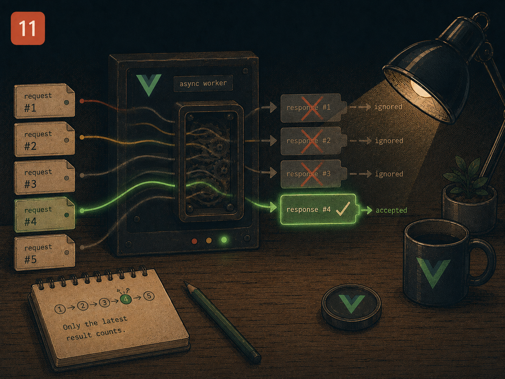

# Lesson 11 — Async work that keeps changing its mind

> Prep for Exercise 11. Concepts and examples only — this page does not
> discuss the exercise's edge cases or its solution.

## The problem

A request that starts because of a keystroke has a lifetime the keystroke
doesn't control. The user can type again before it resolves, or navigate
away before it resolves at all — and network responses don't arrive in the
order their requests were sent. Code that assumes "the response I'm handling
right now is the one that matters" breaks the instant a user types faster
than the network responds, which is most of the time.

## The main idea

A first attempt at "search as you type" fires a request on every change to
the query:

```vue
<script setup lang="ts">
import { ref, watch } from 'vue'
import { fetchResults } from './api'

const query = ref('')
const results = ref<string[]>([])

// DOES NOT WORK — fires a request on every keystroke
watch(query, async q => {
  results.value = await fetchResults(q)
})
</script>
```

Typing `"vue"` fires four separate requests — one after `v`, `vu`, `vue`. Each
one hits the network for a query the user has already moved past. The fix
for *this* problem is a debounce: wait for a pause in typing before actually
requesting.

```ts
watch(query, q => {
  clearTimeout(timer)
  timer = window.setTimeout(async () => {
    results.value = await fetchResults(q)
  }, 300)
})
```

That's better, but it only delays *when* the request fires — it does nothing
about the four requests that might still be in flight if the user keeps
typing across multiple 300ms gaps, or about responses arriving out of order.

**Failure mode 1 — no cancellation.** Each debounced call still starts a
brand-new request without cancelling whatever the previous call left
running. Slow connections mean several requests can be genuinely in flight
at once, each eventually resolving and overwriting `results` in whatever
order they happen to finish — not necessarily the order they were sent in.

The fix is `AbortController`: cancel the previous request before starting a
new one, using `onWatcherCleanup` to tie the abort to "this watcher callback
is about to run again":

```ts
import { onWatcherCleanup, ref, watch } from 'vue'

watch(query, q => {
  const controller = new AbortController()
  onWatcherCleanup(() => controller.abort())

  const timer = window.setTimeout(async () => {
    results.value = await fetchResults(q, controller.signal)
  }, 300)
  onWatcherCleanup(() => clearTimeout(timer))
})
```

`onWatcherCleanup` registers a function that runs right before the watcher's
next invocation (or when its scope is disposed) — so every new keystroke
cancels the timer *and* aborts the in-flight request from the previous one,
before starting fresh.

**Failure mode 2 — the abort doesn't always land in time.** `abort()` cancels
a real in-flight `fetch`, but a mocked API in a test, or an API that ignores
the abort signal, may resolve anyway. If the callback still does
`results.value = await fetchResults(...)` unconditionally, a response that
was meant to be cancelled can still overwrite newer results the moment it
resolves late. Aborting the request is necessary but not sufficient — the
code also needs to check, once a response arrives, whether it's still the
one that matters.

The fix is a request ticket: a counter bumped on every new search, captured
by each request's closure, checked before that request is allowed to write
its result.

```ts
let ticket = 0

watch(query, q => {
  const myTicket = ++ticket
  const controller = new AbortController()
  onWatcherCleanup(() => controller.abort())

  const timer = window.setTimeout(async () => {
    const data = await fetchResults(q, controller.signal)
    if (myTicket === ticket) results.value = data
  }, 300)
  onWatcherCleanup(() => clearTimeout(timer))
})
```

Even if an old, "cancelled" request resolves anyway, `myTicket === ticket`
is false by the time it does — a newer search has already bumped the
counter — so its result is silently discarded instead of overwriting
`results`.

**Failure mode 3 — treating cancellation as failure.** `controller.abort()`
makes the aborted `fetch` promise reject with an `AbortError`. Catching every
rejection the same way and setting an error state means every keystroke
after the first flashes an error banner for the request it just cancelled on
purpose:

```ts
try {
  const data = await fetchResults(q, controller.signal)
  if (myTicket === ticket) results.value = data
} catch (err) {
  if (err instanceof Error && err.name === 'AbortError') return  // expected, not a failure
  if (myTicket === ticket) error.value = true
}
```

An aborted request isn't a failed search — it's a search that got superseded
before it mattered. Only a request that both fails *and* is still the
current ticket should ever set visible error state.

## Reference

→ `docs/PATTERNS.md` § "Async watchers: debounce, abort, and stale responses"
→ `docs/PATTERNS.md` § "Watchers for Side Effects"
→ Earlier lessons: none — Lesson 11 owns `watch` cleanup, debounce and
  stale-response races

## Sources

- Vue.js official docs — [`onWatcherCleanup()`](https://vuejs.org/api/reactivity-core.html#onwatchercleanup)
- Vue.js official docs — [Watchers: side effect cleanup](https://vuejs.org/guide/essentials/watchers.html#side-effect-cleanup)
- MDN — [`AbortController`](https://developer.mozilla.org/en-US/docs/Web/API/AbortController)
- MDN — [`AbortSignal`: the `abort` event and `AbortError`](https://developer.mozilla.org/en-US/docs/Web/API/AbortSignal)
- VueUse docs — [`useDebounceFn`](https://vueuse.org/shared/useDebounceFn/) and [`refDebounced`](https://vueuse.org/shared/refDebounced/) (production-grade debounce composables built on the same idea taught here)
- VueUse docs — [`useFetch` — abort and race-condition handling](https://vueuse.org/core/useFetch/) (VueUse's own solution to stale-response races, worth comparing against the request-ticket approach above)
- Anthony Fu — [Reinventing Vue.js Reactivity: watcher cleanup and effect scope](https://antfu.me/posts/reinventing-vue-reactivity-in-vueuse) (VueUse author on the lifecycle primitives this lesson builds on)

## Now do Exercise 11
