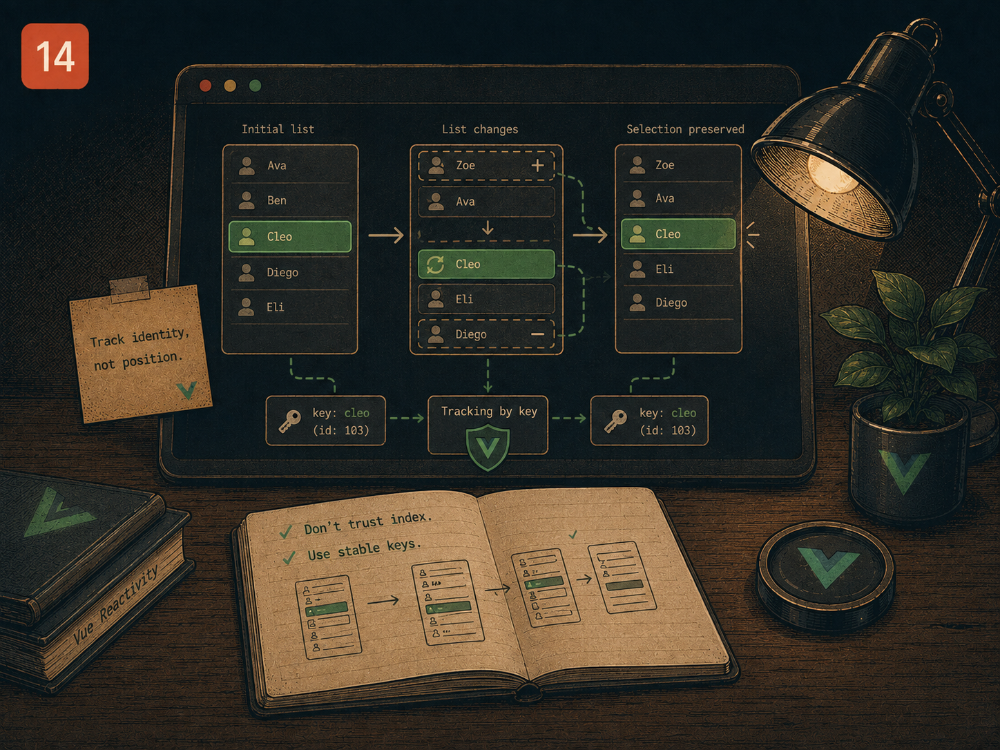

# Lesson 14 — When the list changes under the selection

> Prep for Exercise 14. Concepts and examples only — this page does not
> discuss the exercise's edge cases or its solution.

## The problem

"Which item is selected" seems like it should just be a reference to that
item. That works fine as long as the list never changes. The moment the list
can be refetched or re-ordered — a real app's data usually can be — a stored
reference to "the selected object" is a reference to a specific object
instance, and a refresh typically produces brand-new object instances even
when the underlying data is identical. The selection then either points at
an object that's no longer part of the current list, or — worse — silently
keeps pointing at stale data that a refresh was supposed to replace.



## The main idea

Storing the selected item directly looks natural:

```vue
<script setup lang="ts">
import { ref } from 'vue'

interface Category {
  id: string
  label: string
}

const props = defineProps<{ categories: Category[] }>()
const selected = ref<Category | null>(props.categories[0] ?? null)

function select(category: Category) {
  selected.value = category
}
</script>

<template>
  <button
    v-for="category in categories"
    :key="category.id"
    :class="{ active: selected?.id === category.id }"
    @click="select(category)"
  >
    {{ category.label }}
  </button>
</template>
```

This works for a static list. It breaks the moment `categories` is replaced
by a refetch — even one returning the exact same ids and labels. A fresh
array from an API call contains **new object instances**; the old
`selected` object is not `===` any object in the new array, even if its
fields are identical. Comparisons like `selected?.id === category.id` still
work by luck here because they compare by id, but anything comparing
`selected === category` directly would now consider nothing selected — and
if the old selected object simply gets dropped from the new list, there's no
mechanism here to notice and fall back to something valid.

The fix is to never store the object — store its **id**, and derive the
actual selected object fresh from whatever the current list is:

```vue
<script setup lang="ts">
import { computed, ref, watch } from 'vue'

interface Category {
  id: string
  label: string
}

const props = defineProps<{ categories: Category[] }>()
const selectedId = ref<string | null>(props.categories[0]?.id ?? null)

const selected = computed(
  () => props.categories.find(c => c.id === selectedId.value) ?? null,
)

function select(id: string) {
  selectedId.value = id
}

watch(
  () => props.categories,
  categories => {
    const stillExists = categories.some(c => c.id === selectedId.value)
    if (!stillExists) selectedId.value = categories[0]?.id ?? null
  },
)
</script>

<template>
  <button
    v-for="category in categories"
    :key="category.id"
    :class="{ active: selectedId === category.id }"
    @click="select(category.id)"
  >
    {{ category.label }}
  </button>
</template>
```

`selected` is now a `computed` that looks up the current object by id every
time it's read — it's derived, not stored, so a refresh producing new object
instances with the same ids doesn't affect it at all; the lookup just finds
the new instance instead of the old one. The `watch` on the `categories`
prop handles the one case a lookup alone can't: when the selected id
genuinely no longer exists in the new list at all. Without it, `selected`
would just silently become `null` (the `.find()` returns nothing) with no
new selection ever chosen; the watcher notices that specific case and picks
a fallback.

## Reference

→ `docs/PATTERNS.md` § "Computed Properties for Filtering & Sorting"
→ `docs/PATTERNS.md` § "Watchers for Side Effects"
→ Earlier lessons: [Lesson 13](./13-accordion.md) for single-source
  selection state, [Lesson 11](./11-async-search.md) for `watch` mechanics

## Sources

- Vue.js official docs — [`computed()`](https://vuejs.org/api/reactivity-core.html#computed)
- Vue.js official docs — [Computed Properties](https://vuejs.org/guide/essentials/computed.html)
- Vue.js official docs — [`watch()`](https://vuejs.org/guide/essentials/watchers.html)
- Vue.js official docs — [List Rendering: reactivity caveats with objects/arrays](https://vuejs.org/guide/essentials/list.html#array-change-detection)
- Michael Thiessen — [Vue's `reactive` vs. object identity pitfalls](https://michaelnthiessen.com) (independent Vue educator's writing on why derived-by-id state avoids stale-object-reference bugs)
- VueUse docs — [`useArrayFind`](https://vueuse.org/array/useArrayFind/) (production composable for the same "derive current item by id from a list" pattern taught here)

## Now do Exercise 14

<a href="https://github.com/GadDev/vue-mid-level-certification/tree/main/packages/14-tabs" target="_blank">Open exercise on GitHub</a>

<MarkComplete id="14" />
