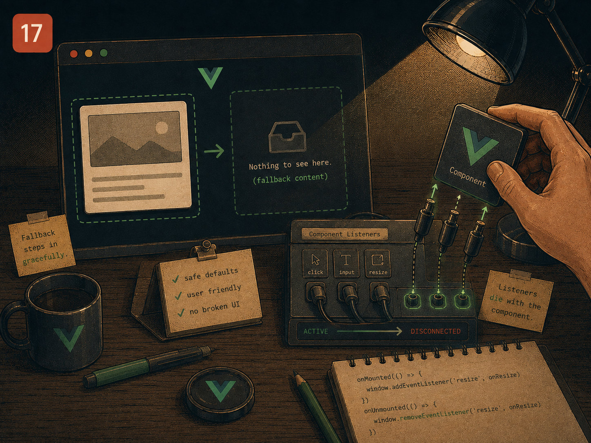

# Lesson 17 — Fallback content, and listeners that die with the component

> Prep for Exercise 17. Concepts and examples only — this page does not
> discuss the exercise's edge cases or its solution.

## The problem

A popover or overlay that closes on `Escape` needs a `keydown` listener on
`window` — the key can be pressed anywhere on the page, not just while focus
is inside the component. That listener has a lifetime that doesn't simply
match the component's mount/unmount: a popover component is often mounted
once and then toggled open and closed repeatedly through a prop, so "add the
listener in `onMounted`" and "the listener should only be active while open"
are two different requirements that look like the same thing at first.

## The main idea

Adding the listener once, on mount, seems like the obvious place:

```vue
<!-- Popover.vue — DOES NOT WORK correctly for a toggled popover -->
<script setup lang="ts">
import { onMounted, onUnmounted } from 'vue'

const props = defineProps<{ open: boolean }>()
const emit = defineEmits<{ close: [] }>()

function onKeydown(e: KeyboardEvent) {
  if (e.key === 'Escape') emit('close')
}

onMounted(() => window.addEventListener('keydown', onKeydown))
onUnmounted(() => window.removeEventListener('keydown', onKeydown))
</script>
```

`onMounted` runs once, when the component instance is first created —
regardless of whether `props.open` is `true` or `false` at that moment. If
the popover component is mounted once by its parent and then toggled open
and closed purely through the `open` prop (a common pattern, since it avoids
repeatedly creating and destroying the component), the `keydown` listener is
attached for the component's *entire* lifetime, not just the moments it's
actually open. Pressing `Escape` while the popover is closed still fires
`emit('close')`, for a popover that was never showing anything to close.

The fix is to tie the listener's lifetime to the `open` prop itself, adding
and removing it in response to that prop changing, with `onUnmounted` kept
only as a safety net for the case where the component is destroyed while
still open:

```vue
<!-- Popover.vue -->
<script setup lang="ts">
import { onUnmounted, watch } from 'vue'

const props = defineProps<{ open: boolean }>()
const emit = defineEmits<{ close: [] }>()

function onKeydown(e: KeyboardEvent) {
  if (e.key === 'Escape') emit('close')
}

watch(
  () => props.open,
  isOpen => {
    if (isOpen) {
      window.addEventListener('keydown', onKeydown)
    } else {
      window.removeEventListener('keydown', onKeydown)
    }
  },
)

onUnmounted(() => window.removeEventListener('keydown', onKeydown))
</script>
```

Now the listener's presence tracks `open` directly: it's attached the moment
`open` becomes `true`, removed the moment it becomes `false` again, and
`onUnmounted` guarantees it's also removed if the component is torn down
while still open — so a listener never survives past the one component
instance that added it, and never stays active for a popover the user
already closed. This is the general shape of the rule: a global listener's
add/remove pair should mirror exactly the condition under which the
listener should be *active*, not just the component's raw mount and unmount.

## You'll also meet

**`@click.self`.** A backdrop element behind an overlay should close it when
clicked directly, but not when a click *inside* the overlay's content
bubbles up to the backdrop through normal event propagation:

```vue
<template>
  <div class="backdrop" @click.self="emit('close')">
    <div class="panel">
      <button @click="doSomething">This click must not close the backdrop</button>
    </div>
  </div>
</template>
```

A plain `@click` on `.backdrop` fires for *any* click that bubbles through
it, including one that originated on the button inside `.panel`. `.self`
restricts the handler to fire only when the backdrop element itself was the
actual click target — not merely an ancestor the event happened to pass
through on its way up.

**The ARIA dialog contract.** A modal or popover that overlays the page is
`role="dialog"` (or `role="alertdialog"` for one requiring an immediate
response) with `aria-modal="true"` — see
[Lesson 13](./13-accordion.md#the-aria-contract) for the general shape of
declaring a widget's role and state explicitly rather than relying on visual
presentation alone.

For slots with fallback content — a `footer` slot that falls back to a
default action when the caller doesn't supply one — see
[Lesson 07](./07-data-table-slots.md), which covers named slots, scoped
slots and fallback content in full.

## Reference

→ `docs/PATTERNS.md` § "Event Handlers & Inline Handlers"
→ Earlier lessons: [Lesson 07](./07-data-table-slots.md) for slots and
  fallback content, [Lesson 13](./13-accordion.md) for the ARIA contract
  pattern

## Sources

- Vue.js official docs — [`watch()`](https://vuejs.org/guide/essentials/watchers.html)
- Vue.js official docs — [Lifecycle Hooks: `onMounted`/`onUnmounted`](https://vuejs.org/guide/essentials/lifecycle.html)
- Vue.js official docs — [Event Handling: event modifiers (`.self`, etc.)](https://vuejs.org/guide/essentials/event-handling.html#event-modifiers)
- W3C WAI-ARIA Authoring Practices — [Dialog (Modal) Pattern (`role="dialog"`, `aria-modal`)](https://www.w3.org/WAI/ARIA/apg/patterns/dialog-modal/)
- VueUse docs — [`onKeyStroke`](https://vueuse.org/core/onKeyStroke/) and [`useEventListener`](https://vueuse.org/core/useEventListener/) (production composables for the same conditional global-listener lifecycle taught here)
- Anthony Fu — [VueUse: `useEventListener` implementation notes](https://antfu.me) (VueUse author on tying listener lifetime to reactive conditions rather than raw mount/unmount)

## Now do Exercise 17
