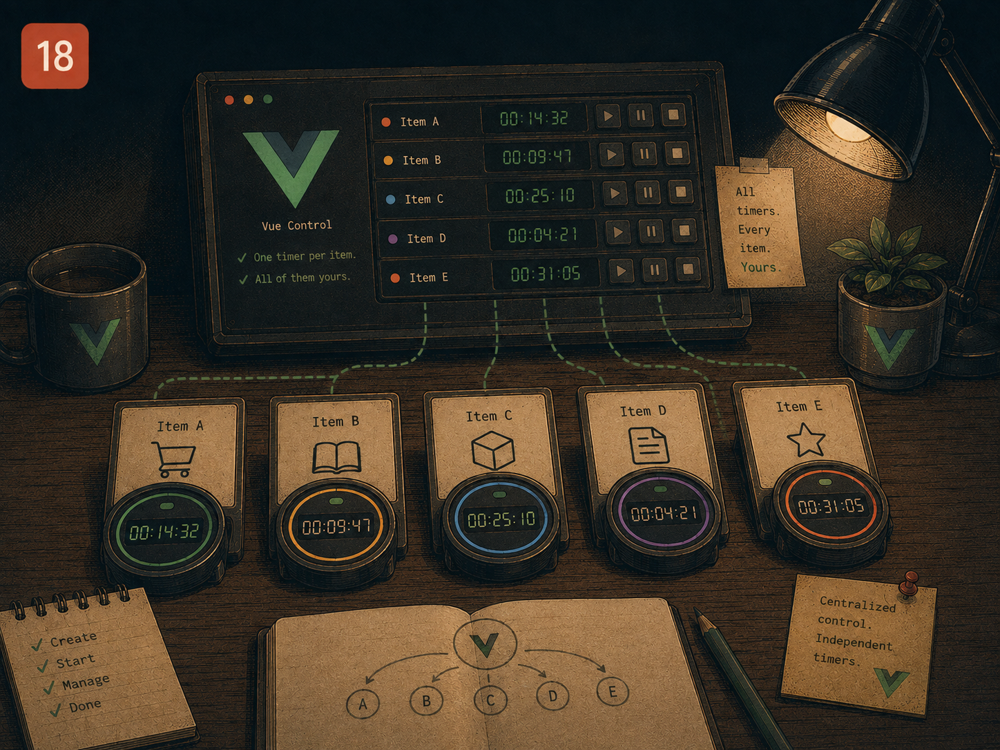

# Lesson 18 — One timer per item, all of them yours

> Prep for Exercise 18. Concepts and examples only — this page does not
> discuss the exercise's edge cases or its solution.

## The problem

A queue of items that each expire on their own schedule needs one timer per
item, not one timer for the whole queue — item A queued three seconds before
item B should expire three seconds earlier, independent of whatever happens
to B. That's manageable while items only ever expire naturally. It stops
being manageable the instant an item can also be removed *early*, by the
user — because now every timer has to be individually cancellable, and
whichever piece of code removes an item early has to know exactly which
timer belongs to it.



## The main idea

Queuing an item and starting its timer is the easy part:

```ts
// useReminders.ts — DOES NOT WORK once early removal is added
import { ref } from 'vue'

interface Reminder {
  id: number
  text: string
}

export function useReminders(duration = 3000) {
  const reminders = ref<Reminder[]>([])
  let nextId = 1

  function add(text: string) {
    const id = nextId++
    reminders.value.push({ id, text })
    setTimeout(() => {
      reminders.value = reminders.value.filter(r => r.id !== id)
    }, duration)
    return id
  }

  function remove(id: number) {
    reminders.value = reminders.value.filter(r => r.id !== id)
  }

  return { reminders, add, remove }
}
```

This looks complete — each `add` starts its own timer, closed over its own
`id`, and `remove` filters by id too. The gap only shows up when `remove` is
called *before* that item's timer fires: `remove` takes the item out of
`reminders.value`, but the `setTimeout` callback that was scheduled for it
is still pending. When that timer eventually fires, it still runs its
filter — harmlessly, since the id is already gone — but the timer itself was
never actually cancelled, just left to run to completion doing nothing.
Multiply this by dozens of early removals in a busy queue and there's a
growing pile of scheduled callbacks doing pointless work, none of them
freed until they individually expire on their own.

The fix is to track each item's timer handle alongside the item itself, so
`remove` can `clearTimeout` it directly instead of just letting it run out:

```ts
// useReminders.ts
import { ref } from 'vue'

interface Reminder {
  id: number
  text: string
}

export function useReminders(duration = 3000) {
  const reminders = ref<Reminder[]>([])
  const timers = new Map<number, ReturnType<typeof setTimeout>>()
  let nextId = 1

  function add(text: string) {
    const id = nextId++
    reminders.value.push({ id, text })
    timers.set(
      id,
      setTimeout(() => remove(id), duration),
    )
    return id
  }

  function remove(id: number) {
    reminders.value = reminders.value.filter(r => r.id !== id)
    const timer = timers.get(id)
    if (timer) {
      clearTimeout(timer)
      timers.delete(id)
    }
  }

  return { reminders, add, remove }
}
```

The `Map<id, timer>` is what makes "cancel this one specific item's timer"
possible at all — without it, there's no way to find the right
`setTimeout` handle to clear given only an id. `remove` now does two things
in the same place: drop the item from the visible list, and cancel whatever
timer was scheduled to do the same thing later. Calling `remove` from
*inside* the timer callback itself (the natural-expiry path) reuses the
exact same cleanup, so there's only one code path that ever removes an item,
whether that happens early or on schedule.

The remaining piece is what happens if the whole composable's owning scope
is torn down — a component unmounts, or an `effectScope` is stopped — while
several timers are still pending. Left alone, those `setTimeout` callbacks
would still fire against a `reminders` ref nothing is watching anymore.
`onScopeDispose` (from [Lesson 12](./12-composable-storage.md)) is the right
place to clear every remaining timer in the map at once, the same way it
clears a single event listener there — the scope's cleanup is what
guarantees nothing scheduled by this composable outlives it.

## Reference

→ `docs/PATTERNS.md` § "Composable Functions"
→ Earlier lessons: [Lesson 05](./05-counter-history.md) for composable
  factories, [Lesson 12](./12-composable-storage.md) for `onScopeDispose`

## Sources

- Vue.js official docs — [`onScopeDispose()`](https://vuejs.org/api/reactivity-advanced.html#onscopedispose)
- Vue.js official docs — [Reusability: Composables](https://vuejs.org/guide/reusability/composables.html)
- MDN — [`setTimeout()` / `clearTimeout()`](https://developer.mozilla.org/en-US/docs/Web/API/Window/setTimeout)
- VueUse docs — [`useTimeoutFn`](https://vueuse.org/shared/useTimeoutFn/) (a production composable that owns and clears a single timer the same way this lesson's `Map<id, timer>` owns several)
- Michael Thiessen — [Vue's Best Kept Secret: effectScope](https://michaelnthiessen.com/vue-effect-scope) (on why scope teardown, not just component unmount, is the right place to guarantee cleanup)

## Now do Exercise 18

<a href="https://github.com/GadDev/vue-mid-level-certification/tree/main/packages/18-notification-queue" target="_blank">Open exercise on GitHub</a>
