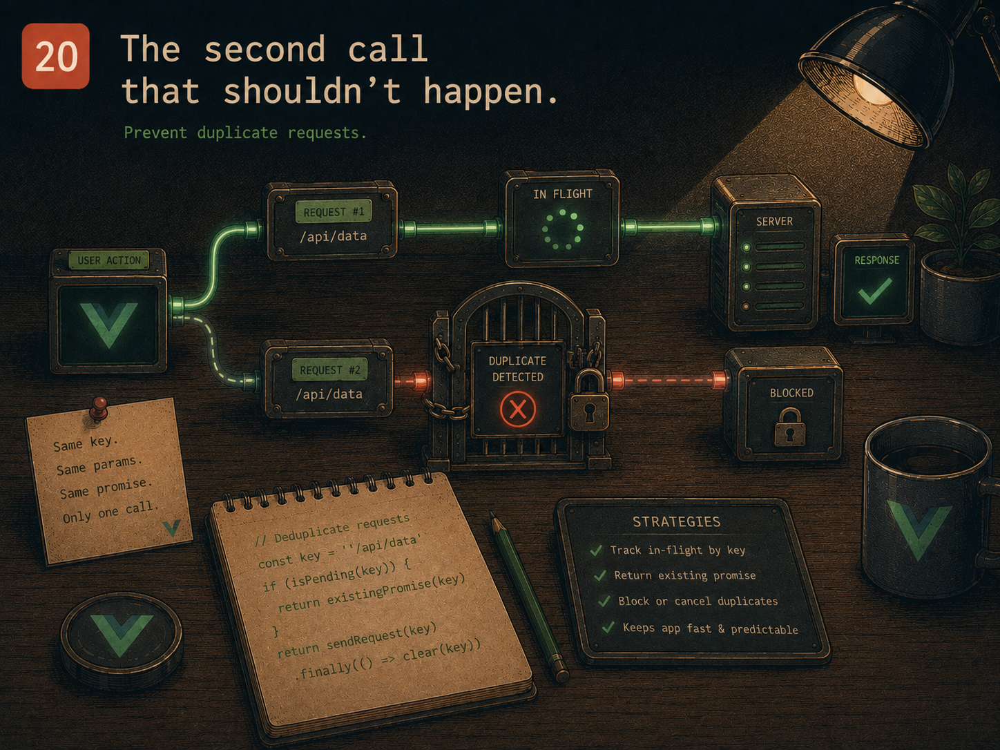

# Lesson 20 — The second call that shouldn't happen

> Prep for Exercise 20. Concepts and examples only — this page does not
> discuss the exercise's edge cases or its solution.

## The problem

Loading more items when the user scrolls near the bottom sounds like a
single async call triggered by a single event. In practice, scroll events
fire repeatedly and rapidly — several can land before the first request even
resolves. Without something explicitly preventing it, "load the next page"
can run two or three times concurrently for what the user experienced as one
continuous scroll, each call fetching and appending the same page again.



## The main idea

A first version calls the loader every time it's invoked, with nothing
stopping overlapping calls:

```ts
// useLoadMore.ts — DOES NOT WORK against overlapping calls
import { ref } from 'vue'

export function useLoadMore<T>(loadPage: (page: number) => Promise<T[]>) {
  const items = ref<T[]>([])
  const page = ref(0)
  const loading = ref(false)

  async function loadMore() {
    loading.value = true
    const nextPage = page.value + 1
    const results = await loadPage(nextPage)
    items.value.push(...results)
    page.value = nextPage
    loading.value = false
  }

  return { items, page, loading, loadMore }
}
```

Call `loadMore()` twice in quick succession — two scroll events close
together, both firing before the first `await loadPage(...)` resolves — and
both calls read `page.value` as the *same* current value before either has
had a chance to update it. Both requests ask for the same next page; both
append their results, producing duplicate items. `loading` gets set to
`true` twice and `false` twice, technically harmless here, but the
underlying race — two calls both reading stale shared state before either
writes back — is the real bug, and it's exactly the shape of race that
causes worse damage once more logic depends on `page` or `loading`.

The fix is an **in-flight guard**: check `loading` before doing anything,
and return immediately if a call is already in progress.

```ts
// useLoadMore.ts
import { ref } from 'vue'

export function useLoadMore<T>(loadPage: (page: number) => Promise<T[]>) {
  const items = ref<T[]>([])
  const page = ref(0)
  const loading = ref(false)

  async function loadMore() {
    if (loading.value) return
    loading.value = true
    try {
      const nextPage = page.value + 1
      const results = await loadPage(nextPage)
      items.value.push(...results)
      page.value = nextPage
    } finally {
      loading.value = false
    }
  }

  return { items, page, loading, loadMore }
}
```

The guard works because `loading.value = true` is set **synchronously**,
before the first `await` — JavaScript's single-threaded execution means no
other call to `loadMore()` can run between the guard check and that
assignment. A second call arriving while the first is still awaiting
`loadPage` sees `loading.value === true` immediately and returns without
touching `page` or issuing a second request at all.

### Terminal states

A paged loader eventually reaches two states that both need to stop further
calls, for different reasons and with different recoveries:

- **Done.** When a page comes back with fewer items than a full page holds
  (including an empty page), there's nothing more to load. `loadMore()`
  should become a no-op from then on — `if (loading.value || done.value)
  return` at the top, alongside the in-flight guard.
- **Errored, but retryable.** When a request fails, the page number must
  **not** advance — the next call to `loadMore()` should retry the exact
  page that failed, not skip ahead to the one after it. That means the
  `page.value = nextPage` write has to happen only on success, inside the
  `try`, after `loadPage` has already resolved — never unconditionally.

```ts
async function loadMore() {
  if (loading.value || done.value) return
  loading.value = true
  error.value = false
  try {
    const nextPage = page.value + 1
    const results = await loadPage(nextPage)
    items.value.push(...results)
    page.value = nextPage
    if (results.length < pageSize) done.value = true
  } catch {
    error.value = true
  } finally {
    loading.value = false
  }
}
```

Both `done` and `error` are terminal in the sense that `loadMore()` checks
for them before doing anything — but `done` is permanent (nothing new is
coming) while `error` is meant to be cleared by the very next successful
call, which is why the retry keeps asking for the same `page` rather than
whatever page would have come next.

The loader itself, `loadPage`, is passed in as a parameter rather than
imported directly — the same shape of idea as
[Lesson 08](./08-theme-provider.md)'s dependency injection, applied to a
function instead of an API object: a test can supply a hand-controlled
`loadPage` instead of a real network call, resolving and rejecting it on
demand to exercise the in-flight guard and both terminal states
deterministically.

## Reference

→ `docs/PATTERNS.md` § "Composable Functions"
→ Earlier lessons: [Lesson 05](./05-counter-history.md) for composable
  factories, [Lesson 08](./08-theme-provider.md) for injecting a
  dependency so tests can control it

## Sources

- Vue.js official docs — [Reusability: Composables — accepting dependencies as parameters](https://vuejs.org/guide/reusability/composables.html)
- Vue.js official docs — [`ref()`](https://vuejs.org/api/reactivity-core.html#ref)
- MDN — [`IntersectionObserver`](https://developer.mozilla.org/en-US/docs/Web/API/IntersectionObserver) (the usual real-world trigger for "load more" that this lesson's `loadMore()` guard applies to)
- VueUse docs — [`useInfiniteScroll`](https://vueuse.org/core/useInfiniteScroll/) (production composable with the same in-flight guard and terminal "done" state)
- VueUse docs — [`useAsyncState`](https://vueuse.org/core/useAsyncState/) (a general loading/error/data pattern comparable to this lesson's terminal states)

## Now do Exercise 20

<a href="https://github.com/GadDev/vue-mid-level-certification/tree/main/packages/20-infinite-scroll" target="_blank">Open exercise on GitHub</a>

<MarkComplete id="20" />
